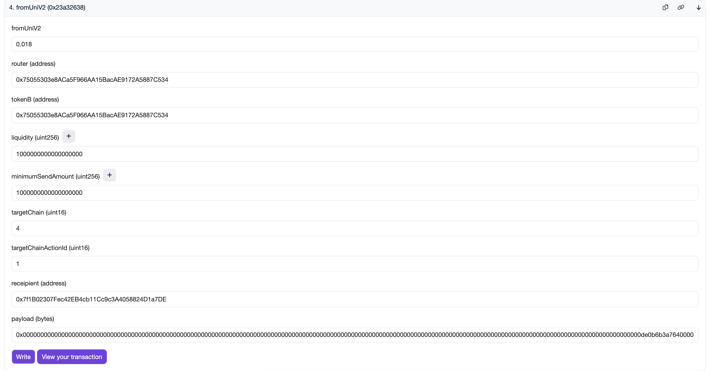

# Alphacado

## Action Id

-   `1`: UniV2TokenAdapter
-   `2`: UniV2LpAdapter
-   `3`: KlayBankAdapter
-   `4`: KlayStationAdapter
-   `5`: VaultAdapter

## How to send request?


Alphacado use layer-based message mechanism. Each layer has its own type of payload encode-decode. Adapter payload need to be encoded off-chain.

### Uniswap Adapter Payload

#### Token Adapter

When to use this adapter?

Sourchain:
If users has token differ than USDC => use this adapter to swap to USDC

Targetchain:
If users want to receive/interact with other protocol require token differ than USDC => send message to this adapter

Payload schema to encode off-chain when using this adapter on target chain:
`(address router, address tokenB, uint256 minimumReceive, bytes additionActionIdPayload)`

-   `router`: protocol router address to swap on target chain
-   `tokenB`: token to receive when swap from USDC
-   `minimumReceive`: minimum tokenB receive

What is `additionActionIdPayload`?

If user just want to receive token on target chain (which means no other protocol to interact) => `additionActionIdPayload` = "" (an empty string)

Otherwise, `additionActionIdPayload` is the encoded of `(uint16 actionId, bytes additionActionPayload)`

-   See `actionId` list above
-   See how to encode `additionActionPayload` for each protocol below

#### Lp Adapter

When to use this adapter?

Sourchain:
If users has LP => use this adapter to swap to USDC

Targetchain:
If users want to receive/interact other protocol require LP => send message to this adapter

Payload schema to encode off-chain when using this adapter on target chain:
`(address router, address tokenB, uint256 minimumReceiveLiquidity, bytes additionActionIdPayload)`

-   `router`: protocol router address to add liquidity
-   `tokenB`: tokenB in USDC-tokenB pair to add liquidity
-   `minimumReceiveLiquidity`: minimum liquidity receive

What is `additionActionIdPayload`?

If user just want to receive token on target chain (which means no other protocol to interact) => `additionActionIdPayload` = "" (an empty string)

Otherwise, `additionActionIdPayload` is the encoded of `(uint16 actionId, bytes additionActionPayload)`

-   See `actionId` list above
-   See how to encode `additionActionPayload` for each protocol below

## KlayBank, KlayStation payload

When to use this adapter: When user want to interact with these protocol on target chain

-   If user has USDC on source chain: pass these payload directly to alphacado contract (Not implemented)
-   If user has other token or lp: encode this payload in `additionActionPayload` of Uniswap adapter

Payload schema to encode off-chain when using this adapter on target chain:
`(address pool, uint16 referralCode) `

-   `pool`: address of KlayBank/KlayStation pool contract
-   `referralCode`: KlayBank/KlayStation referralCode (can be use 0 right now for placeholder)

## Vault adapter

When to use this adapter: When user want to interact with Alphacado Vault on target chain

-   If user has USDC on source chain: pass these payload directly to alphacado contract (Not implemented)
-   If user has other token or lp: encode this payload in `additionActionPayload` of Uniswap adapter

Payload schema to encode off-chain when using this adapter on target chain:
`(address vault)`

-   `vault`: address of Alphacado Vault

## Example

What if user want to stake token to a pool in KlayBank that use token differ than USDC:

```typescript
import { AbiCoder } from "ethers"; // use ethersv6
const encodeTokenToKlayBank = (
    targetChainRouter: string,
    targetChainTokenB: string,
    minimumTokenReceive: bigint,
    klayBankpool: string,
    klayBankreferralCode: number,
): string => {
    const defaultEncoder = AbiCoder.defaultAbiCoder();
    const klayBankPayload = defaultEncoder.encode(
        ["address", "uint16"],
        [klayBankpool, klayBankreferralCode],
    );
    const KLAYBANK_ACTION_ID = 2;
    const klayBankActionPayload = defaultEncoder.encode(
        ["uint16", "bytes"],
        [KLAYBANK_ACTION_ID, klayBankPayload],
    );

    const uniswapTokenPayload = defaultEncoder.encode(
        ["address", "address", "uint256", "bytes"],
        [
            targetChainRouter,
            targetChainTokenB,
            minimumTokenReceive,
            klayBankActionPayload,
        ],
    );

    return uniswapTokenPayload;
};
```

## Deployed Address

### Mumbai - SourceChain

-   `Alphacado`: 0xbb3e887Db9a28A63e391fe4fFDbB61bA42977c09
-   `Registry`: 0xC1Cc9c48DB05e7475FB5aB1B1b7DcA53615903F1
-   `TokenFactory`:
    0x46Bf7cf267Fa7063c1aA3EEe2EEF4d502aAD30bB

Adapters:

-   `UniV2LPAdapter`: 0x4498aDc1205e7c6Ab49db7dAAC5327C519792972
-   `UniV2TokenAdapter`:
    0x4498aDc1205e7c6Ab49db7dAAC5327C519792972

### BNB Testnet - TargetChain

-   `Alphacado`: 0x872E29b3daeF949848F386bc86Ac9Db5F3301ed3
-   `Registry`: 0xcE748352AaffDfEB3A9948802e99Ed035d3Ed0fD
-   `VaultFactory`: 0xd3D8273B675F546a3f9e4A9AFE207296019647B6
-   `TokenFactory`: 0x1013E9348671a5f289dCf0960DaE2f5D7C970191

Mock Addresses:

-   `MockKlayBankPool`: 0xb29e7e287bD2faf8Fb78abB9Ed2F1c94e3A64b73
-   `MockKlayStationPool`:
    0xc065aC9C3fA25D6f14b9b8fbf3293A94158237f1

Adapters:

-   `UniV2LPAdapter`: 0xAd7D3761e2db63d75155a6f5d9D612B02B78923b
-   `UniV2TokenAdapter`:
    0xAd7D3761e2db63d75155a6f5d9D612B02B78923b
-   `KlayBankAdapter`:
    0x6E26145410f452156c52eb15837D9a4c7737A927
-   `KlayStationAdapter`: 0xBbD61d22E2eB5667191B7aAFbbbD9e6A5aFA0df5
-   `VaultAdapter`: 0x4fF499D8422fC9431176ce7D6A9a47ef33933c6D

### Sepolia - SourceChain

-   `Alphacado`: 0x6291Cf69a372Fbb68a2dF0C619d1DE52F38bBa8f
-   `Registry`: 0xF913940686a4Ff79b7efEC95F67f33c32a059F3C
-   `TokenFactory`:
    0x76CC82Bcff672497bDf60D3034edef6AA8802dD5

Adapters:

-   `UniV2LPAdapter`: 0xF149Ee748C2553f2E8D450A27D7c647E28428781
-   `UniV2TokenAdapter`:
    0xF149Ee748C2553f2E8D450A27D7c647E28428781

### Klaytn - TargetChain

-   `Alphacado`: 0xf30D771D5D1940C3Bbc44d200E87fcce29318CaC
-   `Registry`: 0x5D7b35f85DeD2ebAB9a1EB6fdfC7E652AFcA408A
-   `VaultFactory`: 0xF149Ee748C2553f2E8D450A27D7c647E28428781
-   `TokenFactory`: 0xeC5D5577f756b77398B502B537630D62e546eDB0

Mock Addresses:

-   `MockKlayBankPool`: 0xF913940686a4Ff79b7efEC95F67f33c32a059F3C
-   `MockKlayStationPool`:
    0x6291Cf69a372Fbb68a2dF0C619d1DE52F38bBa8f

Adapters:

-   `UniV2LPAdapter`: 0xF4c12757Aa3b68Fd6fBf3340228D3F06c4044278
-   `UniV2TokenAdapter`:
    0xF4c12757Aa3b68Fd6fBf3340228D3F06c4044278
-   `KlayBankAdapter`:
    0x237E22f7aA165659a603B5eB19a1bd7f2c618391
-   `KlayStationAdapter`: 0xDD3FEcD49ef5f21D9F66d6a462BE5f1b07374F6f
-   `VaultAdapter`: 0x2f803d06090EF86F344083Bcf245849FBb0e4BB0

## Simple Working case

Send `fromUniV2` on UniV2Adapters on Mumbai testnet with these following params:

-   msg.value: 0.018 ether
-   router: 0x8954afa98594b838bda56fe4c12a09d7739d179b (UniV2 router)
-   tokenB: 0x87A35f50E570F909F275F5C8AEC40FbeB9e76D17 (any address must work now)
-   liquidity: 10^18 = 1 ether (any amount must work now)
-   minimumSendAmount: 10^18 = 1 ether (any amount must work now)
-   target chain: 4 (BNB Testnet)
-   target chain action Id: 1 (UniV2Adapter)
-   receipient: your address
-   payload: abi encode of (targetChainRouter, targetChainTokenB, targetChainMinimumReceiveLiquidity) (you can use the gen_payload.ts file)

    
