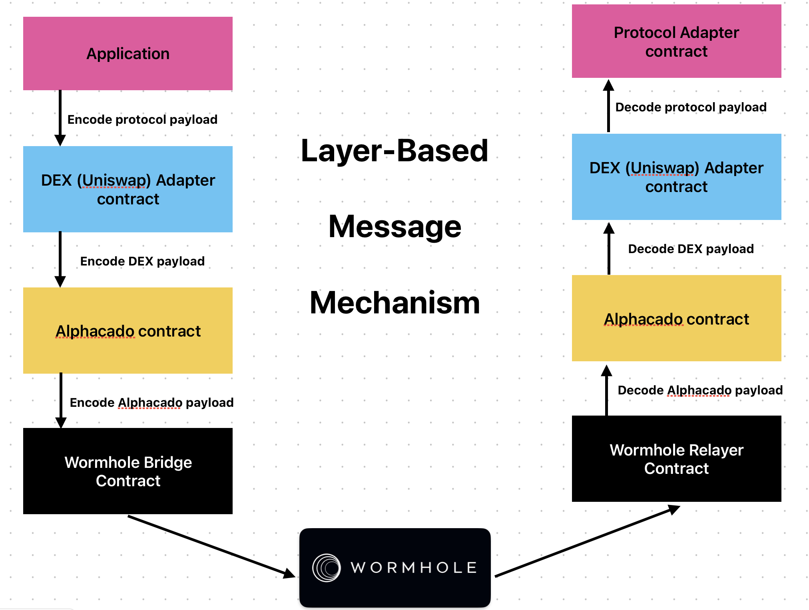

# Alphacado

## Action Id

-   `1`: UniV2TokenAdapter
-   `2`: KlayBankAdapter
-   `3`: KlayStationAdapter
-   `4`: VaultAdapter
-   `5`: UniV2LpAdapter

## How to send request?



Alphacado use layer-based message mechanism. Each layer has its own type of payload encode-decode. Adapter payload need to be encoded off-chain.

### Uniswap Adapter Payload

#### Token Adapter

When to use this adapter?

Sourchain:
If users has token differ than USDC => use this adapter to swap to USDC

Targetchain:
If users want to receive/interact with other protocol require token differ than USDC => send message to this adapter

Payload schema to encode off-chain when using this adapter on target chain:
`(address router, address tokenB, uint256 minimumReceive, bytes additionActionIdPayload)`

-   `router`: protocol router address to swap on target chain
-   `tokenB`: token to receive when swap from USDC
-   `minimumReceive`: minimum tokenB receive

What is `additionActionIdPayload`?

If user just want to receive token on target chain (which means no other protocol to interact) => `additionActionIdPayload` = "" (an empty string)

Otherwise, `additionActionIdPayload` is the encoded of `(uint16 actionId, bytes additionActionPayload)`

-   See `actionId` list above
-   See how to encode `additionActionPayload` for each protocol below

#### Lp Adapter

When to use this adapter?

Sourchain:
If users has LP => use this adapter to swap to USDC

Targetchain:
If users want to receive/interact other protocol require LP => send message to this adapter

Payload schema to encode off-chain when using this adapter on target chain:
`(address router, address tokenB, uint256 minimumReceiveLiquidity, bytes additionActionIdPayload)`

-   `router`: protocol router address to add liquidity
-   `tokenB`: tokenB in USDC-tokenB pair to add liquidity
-   `minimumReceiveLiquidity`: minimum liquidity receive

What is `additionActionIdPayload`?

If user just want to receive token on target chain (which means no other protocol to interact) => `additionActionIdPayload` = "" (an empty string)

Otherwise, `additionActionIdPayload` is the encoded of `(uint16 actionId, bytes additionActionPayload)`

-   See `actionId` list above
-   See how to encode `additionActionPayload` for each protocol below

## KlayBank, KlayStation payload

When to use this adapter: When user want to interact with these protocol on target chain

-   If user has USDC on source chain: pass these payload directly to alphacado contract (Not implemented)
-   If user has other token or lp: encode this payload in `additionActionPayload` of Uniswap adapter

Payload schema to encode off-chain when using this adapter on target chain:
`(address pool, uint16 referralCode) `

-   `pool`: address of KlayBank/KlayStation pool contract
-   `referralCode`: KlayBank/KlayStation referralCode (can be use 0 right now for placeholder)

## Vault adapter

When to use this adapter: When user want to interact with Alphacado Vault on target chain

-   If user has USDC on source chain: pass these payload directly to alphacado contract (Not implemented)
-   If user has other token or lp: encode this payload in `additionActionPayload` of Uniswap adapter

Payload schema to encode off-chain when using this adapter on target chain:
`(address vault)`

-   `vault`: address of Alphacado Vault

## Example

What if user want to stake token to a pool in KlayBank that use token differ than USDC:

```typescript
import { AbiCoder } from "ethers"; // use ethersv6
const encodeTokenToKlayBank = (
    targetChainRouter: string,
    targetChainTokenB: string,
    minimumTokenReceive: bigint,
    klayBankpool: string,
    klayBankreferralCode: number,
): string => {
    const defaultEncoder = AbiCoder.defaultAbiCoder();
    const klayBankPayload = defaultEncoder.encode(
        ["address", "uint16"],
        [klayBankpool, klayBankreferralCode],
    );
    const KLAYBANK_ACTION_ID = 2;
    const klayBankActionPayload = defaultEncoder.encode(
        ["uint16", "bytes"],
        [KLAYBANK_ACTION_ID, klayBankPayload],
    );

    const uniswapTokenPayload = defaultEncoder.encode(
        ["address", "address", "uint256", "bytes"],
        [
            targetChainRouter,
            targetChainTokenB,
            minimumTokenReceive,
            klayBankActionPayload,
        ],
    );

    return uniswapTokenPayload;
};
```

## Deployed Address

### Mumbai - SourceChain

-   `Alphacado`: 0x147d1Ea2f6Fb25322c3bC91c3D1cFfebc4A55576
-   `Registry`: 0x34907cDDbDFFb0a827FD5cd616e7B43667E56f8C
-   `TokenFactory`:
    0xDD3FEcD49ef5f21D9F66d6a462BE5f1b07374F6f

Adapters:

-   `UniV2LPAdapter`: 0x75055303e8ACa5F966AA15BacAE9172A5887C534
-   `UniV2TokenAdapter`:
    0x23d5aF13518776Ec9875Ef403fcF541b692B2b4d

### BNB Testnet - TargetChain

-   `Alphacado`: 0x1972308BC7b0fb4e7CF49Ebef14207b07698a2C1
-   `Registry`: 0x6025b9d66D7d86cd9acD2c80318E447b8cA30A68
-   `VaultFactory`: 0x9E39a440A5420892b5183b2E3F4FBF01eE6FE9EC
-   `TokenFactory`: 0xa5d04bE051851Fe269bc3A0f0ed5B674cC8028b0

Mock Addresses:

-   `MockKlayBankPool`: 0x8843010C138A3eBF5080C6c6374BeA29A2de9e4C
-   `MockKlayStationPool`:
    0x42E5822795468c746932aA7D8bDBc4168cfb5FB4

Adapters:

-   `UniV2LPAdapter`: 0xBB48201ce454826cecf11424566dbb52307BE0D4
-   `UniV2TokenAdapter`:
    0x3B66E8849F197240bb9ab882025FF9D201063B35
-   `KlayBankAdapter`:
    0x4f66d9428780b7c9e192DA9FB1BFc67fF484de5d
-   `KlayStationAdapter`: 0xeFA7D4F3378a79A0985407b4e36955D54808df87
-   `VaultAdapter`: 0x4Dcd3B1027FDbdeb2f8C5E7fE3Ae52746b9cd3A8

### Klaytn

-   `VaultFactory`: 0x8843010C138A3eBF5080C6c6374BeA29A2de9e4C

## Simple Working case

Send `fromUniV2` on UniV2Adapters on Mumbai testnet with these following params:

-   msg.value: 0.018 ether
-   router: 0x8954afa98594b838bda56fe4c12a09d7739d179b (UniV2 router)
-   tokenB: 0x87A35f50E570F909F275F5C8AEC40FbeB9e76D17 (any address must work now)
-   liquidity: 10^18 = 1 ether (any amount must work now)
-   minimumSendAmount: 10^18 = 1 ether (any amount must work now)
-   target chain: 4 (BNB Testnet)
-   target chain action Id: 1 (UniV2Adapter)
-   receipient: your address
-   payload: abi encode of (targetChainRouter, targetChainTokenB, targetChainMinimumReceiveLiquidity) (you can use the gen_payload.ts file)

    
